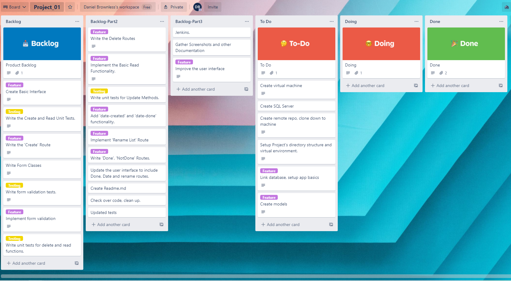
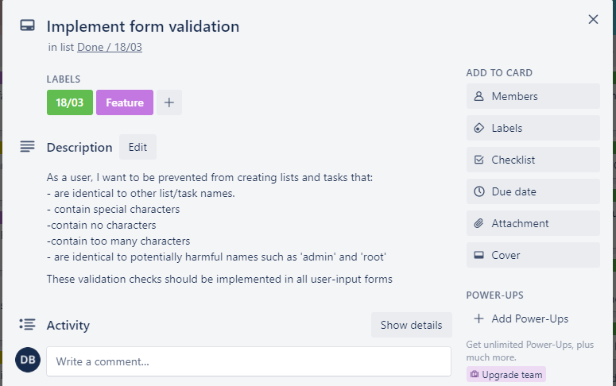

# ToDoLists
Author: Daniel Brownless
# Project Scope
I am building a CRUD functional web application using python, flask, and html.
## Business Rules:
The user must be able to:
* create new lists
* create new tasks on each list
* see the lists and corresponding tasks that they have created
* See the lists' creation date
* see the 'marked done' date for lists and tasks.
* rename lists
* mark lists as done or not-done
* mark tasks as done or not-done
* Delete lists, with their corresponding tasks.
* delete individual tasks from a list.
* store their lists on the app
* easily navigate the app
# Risk Assessment

# Project Architecture
my directory structure:

my 'pipeline'

My tech stack is as follows:
* Programming Languages: Python
* Unit testing: Pytest, Flask-testing
* Front End: Flask, HTML, CSS
* Version Control: Git
* Repository Hosting: Github
* Repository
* CI Server: Jenkins
* Cloud Server: GCP Compute Engine
* Database: GCP SQL Server
* Project Tracking: Trello

# Database Structure

* One-to-many relationship.
* 'Checklist' is a strong entity type
* 'Task' is a weak entity type  \

Data structure is implemented in models.py:

# Project Tracking
Start of project:

End of project:

User story examples:

# Git Process
Git commands used:
* git config --global
* git clone 
* git checkout -b
* git branch
* git add .
* git commit -m 
* git push
* git pull
* git log --oneline
* git status

# Build Scripts

# Testing

# Summary
## What I could have done better:
* Referred to plan more
* Git process - smaller commits
* Security - Database URI.
* More focus on Test-Driven Development
## Other comments
If I had more time, some of the features I would add are:
* Individualised Sessions, using a login system.
* A search function
* The ability to set deadlines.
